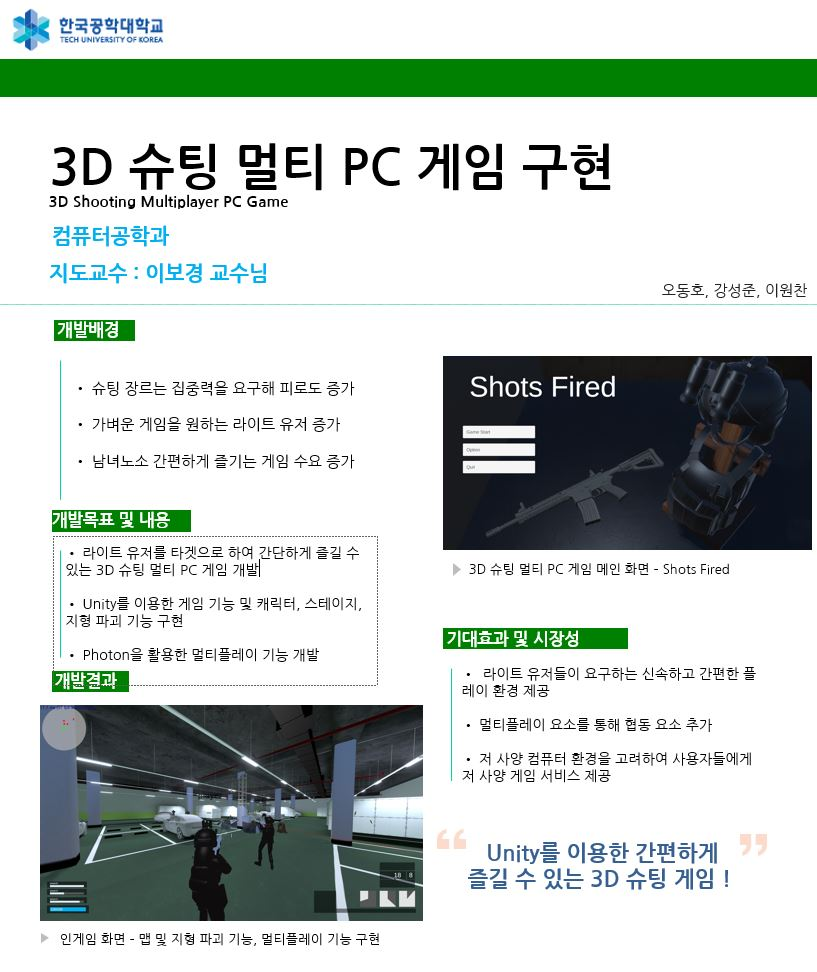

# 3D 슈팅 멀티 PC 게임 구현

## Demo Video

### [비디오 영상 링크](https://drive.google.com/file/d/1miHIUWK3hSFgOFWya59s_EQkEq9fKK42/view?usp=sharing)

## 2022년 한국공학대학교 컴퓨터공학과 졸업작품_팀_Shotsfired

  

## **주제 선정 배경**

“트리플 A 타이틀”이라고 부르는 게임은 대작이라 불릴 만큼 수많은 컨텐츠와 즐거움을 제공해준다. 하지만 대작을 만들기 위해선 개발 비용이 천문학적인 제작비가 들어간다. 성공이 보장되지 않는 게임에 개발 비용을 투자하는 것은 수지타산에 맞지 않게 보일 수 있다. 계속 이어지는 흐름으로 인해 출시되는 대작들은 성공을 위해 너무나 많은 콘텐츠를 제공하기 때문에 간단히 즐길 라이트 유저들이 대상으로 잡지 않고 숙달된 헤비 유저들을 대상으로 개발한다.  
라이트 유저들이 즐기기엔 적합하지 않다고 판단하여, 남녀노소 간편하게 즐길 수 있는 게임을 개발하고자 한다. 본 프로젝트는 라이트 유저들을 대상으로 잡은 슈팅 게임을 제공한다.

## **개발 목표**

현 게임시장의 수요를 만족시키지 못하는 3D 슈팅 멀티 PC게임 소프트웨어의 테스트 버전 개발을 목표로 한다.  
물리 효과 구현을 통해 화려하고 전략적인 플레이를 제공한다. 라이트 유저들이 쉽게 접근할 수 있게 간단한 조작을 통해 즐길 수 있다. 카툰 및 실사 그래픽을 혼합하여 더 풍부하고 깊은 미적 요소를 보여준다. 멀티 플레이 구현을 통해 협동 플레이를 할 수 있다.

## **기술 스택**

</img>
</img>
</img>
</img>
</img>
</img>

</img>
</img>
</img>
</img>

* 개발 툴 : Unity, Photon

* 개발 언어 : C#

* 게임 리소스 개발 툴 : 3Ds Max2021, Blender, Substance Painter, ClipStudio

* 협업 및 회의 : Github, Discord, Notion

## 아키텍처

* 클라이언트 설계

* 포톤(Photon) 서버 설계

## 유니티 환경 설정 메뉴얼

* 패키지 매니저에서 아래 패키지들을 설치
  * Animation Rigging
  * Cinemachine  
  * Post Process
  * ProBuilder

## 파일들

> 게임 완성 및 논문(2022.3~10)  
> >[최종 수행 보고서](./document/%EA%B2%8C%EC%9E%84%20%EB%B3%B4%EA%B3%A0%EC%84%9C%20%EC%B5%9C%EC%A2%85.pdf)  
> >[졸업 논문](./document/%EC%A1%B8%EC%97%85%EB%85%BC%EB%AC%B8.pdf)

> 기획 설계및 POC 완성(2021.12~2022.3)
> >[게임 설계](./document/%EA%B2%8C%EC%9E%84%EC%84%A4%EA%B3%84.pptx)  

> 기획 문서 (2021.8~11)
> > [요약계획서.pdf](./document/%EC%9A%94%EC%95%BD%EA%B3%84%ED%9A%8D%EC%84%9C.pdf)
> > [게임 기획서 1.00.00.pdf](https://github.com/DonghoOh-pipity03/2022_KPU_CE_Shotfire/files/8369529/1.00.00.pdf)  
> > [추가 게임기획서 0.02.00.pdf](https:/~~/github.com/~~DonghoOh-pipity03/2022_KPU_CE_Shotfire/files/8369535/0.02.00.pdf)  
> > [상세설계 1.00.00.pdf](https://github.com/DonghoOh-pipity03/2022_KPU_CE_Shotfire/files/8369530/1.00.00.pdf)  
> > [UI 기획서_1.01.00.pdf](https://github.com/DonghoOh-pipity03/2022_KPU_CE_Shotfire/files/8369539/UI._1.01.00.pdf)
> >[시스템_건플레이_1.01.00.xls](https://github.com/DonghoOh-pipity03/2022_KPU_CE_Shotfire/files/8369553/_._1.01.00.xls)  
> >[시스템_스테이지_1.01.00.xls](https://github.com/DonghoOh-pipity03/2022_KPU_CE_Shotfire/files/8369559/_._1.01.00.xls)  
> >[시스템_플레이어블 캐릭터_1.03.00.xls](https://github.com/DonghoOh-pipity03/2022_KPU_CE_Shotfire/files/8369562/_._1.03.00.xls)
> >[컨텐츠_스킬_0.02.00.xls](https://github.com/DonghoOh-pipity03/2022_KPU_CE_Shotfire/files/8369566/_._0.02.00.xls)

## 팀원 구성

| 성함  | 이메일                                                   | 학교이메일                                                 |
| --- |:----------------------------------------------------- | ----------------------------------------------------- |
| 오동호 | [pipity03@naver.com](mailto:pipity03@naver.com)       | [pipity03@kpu.ac.kr](mailto:pipity03@kpu.ac.kr)       |
| 강성준 | [kevin9809@naver.com](mailto:kevin9809@naver.com)     | [karatan1109@kpu.ac.kr](mailto:karatan1109@kpu.ac.kr) |
| 이원찬 | [getchan0119@naver.com](mailto:getchan0119@naver.com) | [getchan0119@kpu.ac.kr](mailto:getchan0119@kpu.ac.kr) |
